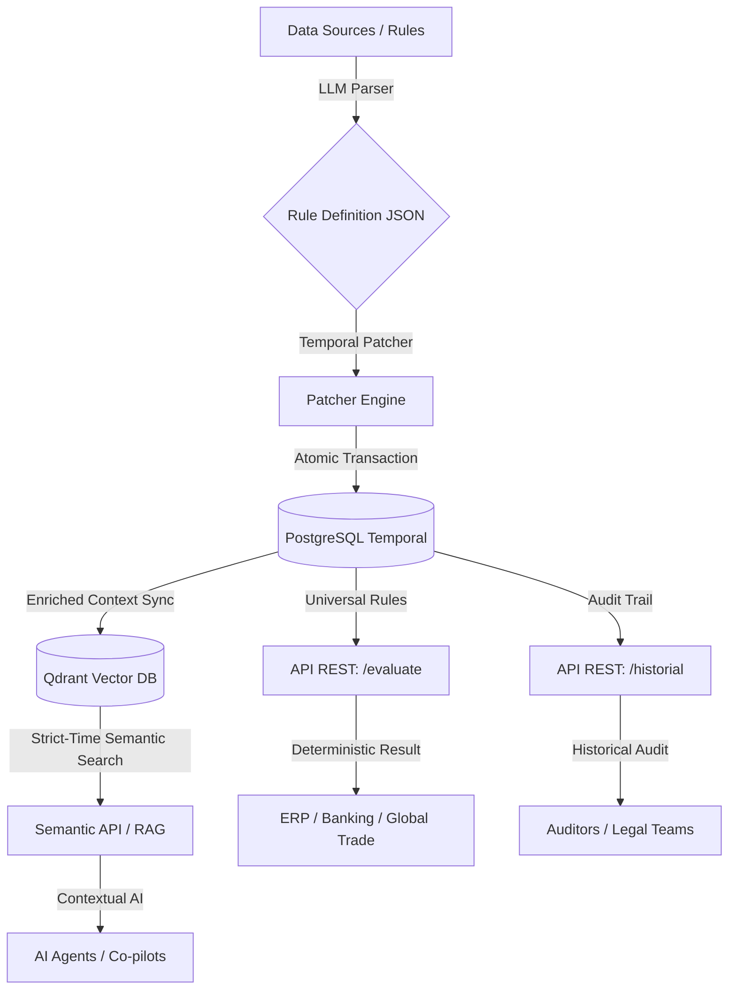

# 📂 Project Bitacora: Tempus Rule Engine

**Cut-off Date:** Feb 26, 2026
**Status:** Successfully pivoted to a Domain-Agnostic, Universal Temporal Rule Engine.
**Repository:** `JPatronC92/Lex-API-Mx`

---

## 1️⃣ What is Tempus?

Tempus is **Universal Compliance Infrastructure**. It treats rules (legal, financial, logistic, medical) as versioned source code. 

By leveraging PostgreSQL's advanced temporal ranges and Qdrant's vector capabilities, Tempus allows for deterministic "Time Travel" evaluation. This means you can ask the engine: *"Was this transaction valid according to the rules active on June 15th, 2024?"* and get a mathematically certain answer, free from AI hallucinations.

---

## 2️⃣ Technical Inventory (Work Done in this Session) 🛠️

During this session, we transformed the project's identity and capabilities to reach "Enterprise-Grade" level.

### A. The Pivot (Lex-MX -> Tempus) 🚀
*   **Agnostic Architecture:** Removed all hardcoded legal dependencies to create a universal rule engine for any sector (Aduanas, Fintech, Healthcare).
*   **Repo Consolidation:** Refactored the entire repository structure, moving from a nested `lex-mx-engine/` folder to a clean, flat root structure.
*   **Global Rebranding:** Updated `pyproject.toml`, `config.py`, and `docker-compose.yml` to reflect the **Tempus Rule Engine** identity.

### B. Compliance Guard (Input Validation) 🛡️
*   **JSON Schema Integration:** Added pre-execution validation. Now, rules can define an optional JSON Schema to verify the ERP/Bank transaction context *before* evaluating logic, preventing data errors.

### C. The Semantic Wing (RAG Infrastructure) 🧠
*   **Qdrant Vector DB:** Implemented the infrastructure to vectorize rules with strict temporal metadata.
*   **Universal Evaluator:** Created the `POST /api/v1/compliance/evaluate` endpoint, capable of "Time-Travel" for any rule set.

### D. Engineering Standards ⚙️
*   **CI/CD Pipeline:** Implemented GitHub Actions (`.github/workflows/main.yml`) that spins up ephemeral Postgres and Qdrant services to validate tests on every push.
*   **Professional Docs:** Created a high-quality `README.md` with architectural diagrams and a comprehensive guide.
*   **Security & GitFlow:** Managed Git branches, commits, and remote synchronization via secure PATs.

---

## 3️⃣ System Architecture (Phase 2)

---

## 4️⃣ Roadmap (What's Next?) 🛤️

The next phase aims for performance and enterprise scaling:

1.  **🦀 Rust Core Migration:** Rewriting the core logic in Rust to achieve <1ms latency and handle 100k+ TPS, making it suitable for high-frequency trading or massive global trade hubs.
2.  **🖥️ Backoffice UI:** Developing a React/Streamlit dashboard to visualize temporal ranges, manage rules, and provide a "Human-in-the-Loop" approval system for AI-proposed rules.
3.  **🏢 Multi-Tenant Support:** Architecture to isolate rule sets and data for different corporate clients or industries within the same infrastructure.
4.  **🔗 ERP Adapters:** Building pre-set adapters/schemas for SAP, NetSuite, and major banking APIs.
